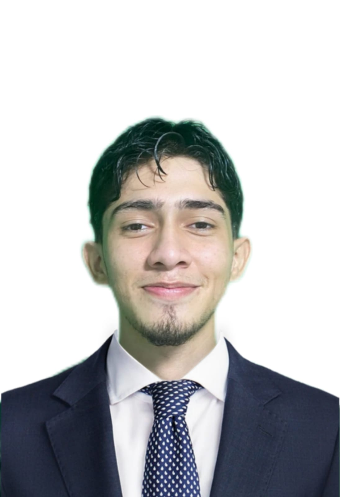

#  Hoja de Vida - Octavio Gutiérrez Villamil

## 📍 Información Personal
- **Dirección:** Cra 25#21-21 Concord, Malambo
- **Teléfono:** 3009427098  
- **Correo Electrónico:** octaviogvillamil18@gmail.com  

## 🎯 Objetivo Profesional
Como futuro Analista de Software, mi principal meta es culminar exitosamente mi formación técnica, destacarme en competencias tecnológicas y aportar valor real a proyectos innovadores.  
Aspiro a integrarme en el sector TI con un empleo estable que me permita crecer profesional y personalmente, apoyar a mi familia —especialmente a mis padres— y convertirme cada día en la mejor versión de mí mismo.

## 🎓 Educación
**Escuela Metropolitana Adela de Char (Malambo)**  
Bachiller Académico – Graduado en 2023

## 🧠 Habilidades
- Trabajo en equipo
- Comunicación efectiva
- Análisis y resolución de problemas

## 🌐 Idiomas
- Español: Nativo  
- Inglés: Nivel básico

## 🌐 Redes Sociales
  

